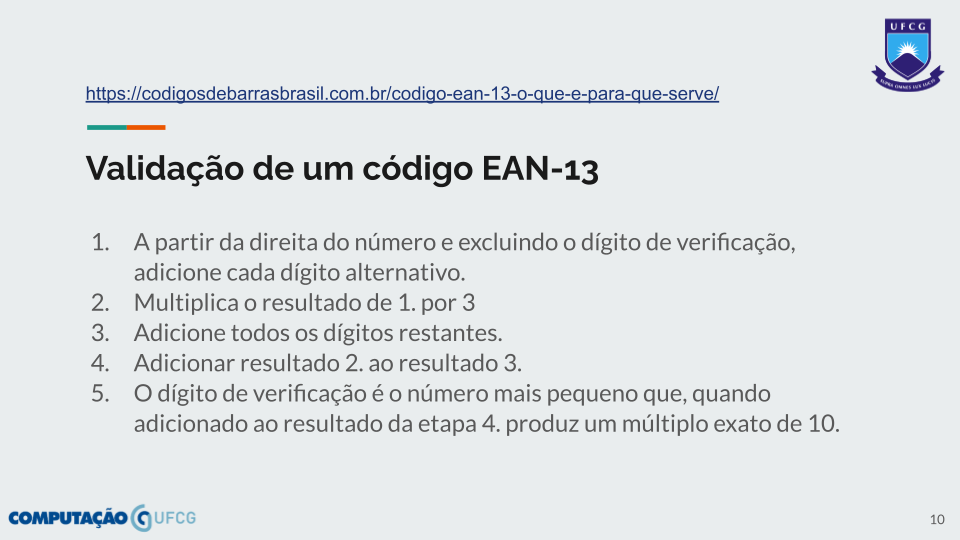
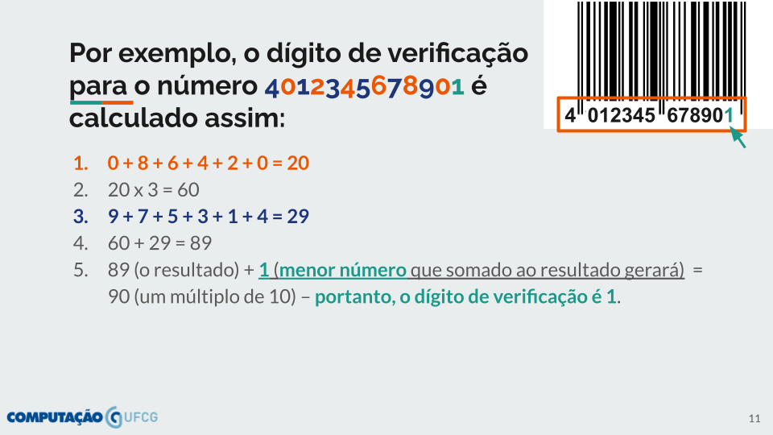

# 🛒 PSoft-Commerce

Projeto básico da disciplina PSoft a ser evoluído em sala de aula nas atividades (assignments) do GitHub Classroom.

### 🔗 Endereços Úteis

- [SpringDoc/Swagger](http://localhost:8080/swagger-ui/index.html)
- [H2 Console](http://localhost:8080/h2-console)

## 📑 User Stories a serem implementadas

- [ ] **USx:** Eu, enquanto Pessoa, quero utilizar o sistema para me cadastrar. Mais detalhadamente, deve ser possível criar, ler, editar e remover pessoas;
  - Atributos esperados para pessoa: identificador único* (numérico), nome*, cpf* (único), email* (único), telefones**, data de nascimento, endereços** (logradouro, número e complemento) e profissão*.
  - Cada pessoa criada no sistema pode ter mais de um endereço ou telefone cadastrados, mas apenas uma profissão. Apenas o nome e cpf de uma pessoa não podem ser atualizados.
  - A atualização simplificada da pessoa deve permitir a alteração do email (único).
- [ ] **USy:** Eu, enquanto Administrador, quero utilizar o sistema para cadastrar Logradouro. Mais detalhadamente, deve ser possível criar, ler, editar e remover logradouros;
  - Atributos esperados no logradouro: identificador único* (numérico), tipo de logradouro*, nome do logradouro*, bairro*, cidade*, estado*, país* e código de endereçamento postal* (CEP).
  - A atualização simplificada do logradouro deve permitir a alteração dos valores "tipo" e "nome" do logradouro.
- [ ] **USz:** Eu, enquanto Gerente, quero utilizar o sistema para cadastrar Produto. Mais detalhadamente, deve ser possível criar, ler, editar e remover produtos;
  - Atributos esperados no produto: identificador único* (numérico), nome do produto*, código de barras* (validado), valor* (em reais, R$) e nome do fabricante*.
  - O valor do produto não poderá ser menor ou igual a zero.
  - Uma atualização simplificada do endereço deve permitir a alteração do código de barras do produto (validado).
  - Outra atualização simplificada do endereço deve permitir a alteração do valor do produto (validado).
  - O código de barras deve ser validado no padrão European Article Number, com 13 dígitos (EAN-13), para o país BRASIL (789), empresa (99999), produto (id com até 4 dígitos, começando em 0001) e dígito verificador no final (nos Slides nº10 e 11 de TDD - Desenvolvimento Guiado por Testes, verifique uma explicação detalhada).

👀 **Observação:**

- Os atributos marcados com asterisco (*) são de preenchimento obrigatório.
- Os atributos marcados com duplo asterisco (**) devem ter pelo menos um valor (dado) cadastrado.

### ✅ Validação de um código de barras EAN-13

